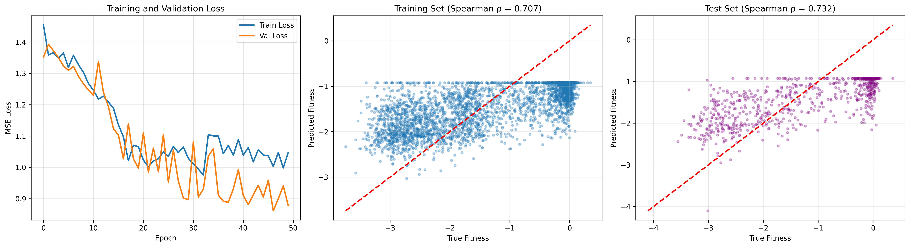

# FitPredict-ML 🧬

**Multi-Modal Protein Fitness Prediction using Deep Learning**

[](https://github.com/ansh-deshwal/FitPredict-ML)
[](https://www.python.org/downloads/)
[-green)](https://github.com/facebookresearch/esm)
[](https://proteingym.org/)
[](LICENSE)

> FitPredict-ML integrates **Sequence (ESM-2)**, **Structure (PDB)**, and **Evolutionary** data to predict protein mutation effects, aiming to accelerate drug discovery without expensive wet-lab experiments.

---

## 🎯 Project Overview

This project predicts the functional effects of protein mutations using a multi-modal deep learning approach. By combining:
- ✅ **Sequence Embeddings** from ESM-2 (650M parameters)
- ✅ **Structural Information** from PDB — 11 features: burial depth, DSSP secondary structure, ASA, contact maps, backbone dihedral angles
- 🔜 **Evolutionary Conservation** (MSA data)

We achieve strong correlation with experimental Deep Mutational Scanning (DMS) data for predicting mutation fitness.

### 🔬 Current Dataset
- **Protein**: β-lactamase (BLAT_ECOLX / TEM-1)
- **Source**: Stiffler et al. 2015
- **Mutations**: 4,996 single-point variants
- **Structure**: PDB ID 1M40 (0.85Å resolution)
- **Metric**: DMS fitness scores

---

## 📊 Project Progress

| Stage | Component | Status | Performance | Description |
|-------|-----------|--------|-------------|-------------|
| **Stage 1** | Data Prep | ✅ **Done** | - | Cleaned & processed β-lactamase dataset |
| **Stage 2** | Sequence Branch | ✅ **Done** | ρ = 0.719 | Extracted 1280-d ESM-2 embeddings |
| **Stage 3** | Baseline Models | ✅ **Done** | ρ = 0.719 | Ridge & MLP trained on sequence only |
| **Stage 4** | Structure Branch | ✅ **Done** | - | Extracted 11 structural features (burial, DSSP, ASA, contact maps, backbone angles) |
| **Stage 5** | Multi-Modal Fusion | ✅ **Done** | ρ = 0.768* | Sequence (1280-d) + Structure (11-d) fusion with residual blocks |
| **Stage 6** | Evolutionary Branch | ⏳ **Pending** | - | MSA features integration |

> *ρ = 0.768 was achieved with the previous 80/20 split; the model needs retraining under the updated 70/10/20 split to produce comparable numbers.

---

## 📈 Current Results

### Baseline Performance (Sequence-Only Models)

| Model | Architecture | Test Spearman ρ | Test Pearson r | Test R² | Parameters |
|-------|-------------|----------------|----------------|---------|------------|
| Ridge Regression | Linear | ~0.500* | ~0.500* | ~0.250* | 1,280 |
| **MLP (3-layer)** | Deep | **0.7190*** ⭐ | 0.7020* | 0.3993* | 721,665 |

### MLP Architecture Details
```
Input (1280) → Dense(512) → ReLU → Dropout(0.3)
              → Dense(128) → ReLU → Dropout(0.3)
              → Dense(1) → Output

Training Configuration:
  - Optimizer: Adam (lr=0.001, weight_decay=1e-5)
  - Loss: MSE
  - Batch Size: 32
  - Epochs: 50
  - Scheduler: ReduceLROnPlateau
  - Best checkpoint saved and reloaded for final evaluation
```

### Training Characteristics
- ✅ **No overfitting** - Test Spearman (0.719) > Train Spearman (0.703)
- ✅ **Smooth convergence** - Learning rate reduced at epoch ~22
- ✅ **Strong rank correlation** - Model captures mutation severity ordering
- 📊 **Performance gap** - ~5-10% below SOTA (ρ ~ 0.75-0.80)

> *All MLP and Ridge metrics above were produced with the old 80/20 split; retraining under the current 70/10/20 split will update these numbers.



### Structural Features (Extended! 🎉)

**Extracted from PDB 1M40 (Ultra-high resolution: 0.85Å)**

| # | Feature | Type | Description |
|---|---------|------|-------------|
| 0 | `burial_score` | Continuous | Number of Cα atoms within 10Å radius |
| 1 | `is_buried` | Binary | 1 if burial score > 20 neighbours, else 0 |
| 2 | `ss_helix` | Binary | 1 if residue is in an α-helix (DSSP: H) |
| 3 | `ss_sheet` | Binary | 1 if residue is in a β-sheet (DSSP: E) |
| 4 | `ss_coil` | Binary | 1 if residue is coil/loop/other (DSSP: C) |
| 5 | `rASA` | Continuous [0,1] | Relative accessible surface area (0=buried, 1=fully exposed) |
| 6 | `sin_phi` | Continuous [-1,1] | sin of backbone φ dihedral angle |
| 7 | `cos_phi` | Continuous [-1,1] | cos of backbone φ dihedral angle |
| 8 | `sin_psi` | Continuous [-1,1] | sin of backbone ψ dihedral angle |
| 9 | `cos_psi` | Continuous [-1,1] | cos of backbone ψ dihedral angle |
| 10 | `contact_count` | Continuous | Number of Cα contacts within 8Å (degree centrality) |

> **Note:** DSSP-derived features (indices 2–9) require the `mkdssp` binary. See [Installation](#️-installation--dssp-setup) below for setup instructions.

**Key Findings (burial features):**
- 42.6% of mutations are in buried (core) regions
- 57.4% of mutations are surface-exposed
- Burial depth correlates with structural stability

**Distribution:**
```
Buried residues (core):    2,128 mutations (42.6%)
Surface residues:          2,868 mutations (57.4%)
```

This structural context is crucial because:
- **Buried mutations** often destabilize protein folding → lower fitness
- **Surface mutations** may affect function without destabilizing structure
- **Secondary structure** (helix/sheet/coil) constrains which mutations are tolerated
- **rASA** quantifies solvent exposure independently of neighbour counting
- **Backbone angles** capture local geometry and conformational rigidity
- **Contact count** provides a graph-theoretic view of structural centrality

---

## 📂 Repository Structure

```
FitPredict-ML/
│
├── Data/
│   ├── BLAT_ECOLX_Stiffler_2015.csv                  # Primary DMS dataset (4,996 mutations)
│   ├── BLAT_ECOLX_Deng_2012.csv                       # Alternative DMS dataset
│   ├── BLAT_ECOLX_Firnberg_2014.csv                   # Alternative DMS dataset
│   ├── BLAT_ECOLX_Jacquier_2013.csv                   # Alternative DMS dataset
│   └── 1M40.pdb                                       # β-lactamase 3D structure
│
├── Scripts/
│   ├── extract_embeddings.py                          # ESM-2 Feature Extractor → Data/
│   ├── extract_structure_features.py                  # PDB Structure Parser (burial + DSSP + contacts) → Results/
│   ├── train_baseline.py                              # Ridge Regression
│   ├── train_mlp.py                                   # MLP Neural Network
│   └── train_fusion.py                                # Multi-modal Fusion (sequence + structure)
│
├── Results/
│   ├── baseline_plot.png                              # Ridge results
│   ├── baseline_predictions.csv                       # Ridge predictions
│   ├── mlp_baseline_plot.png                          # MLP results (3-panel)
│   ├── mlp_predictions.csv                            # MLP predictions
│   ├── fusion_plot.png                                # Fusion model results (3-panel)
│   ├── fusion_predictions.csv                         # Fusion model predictions
│   ├── beta_lactamase_structure_features.npy          # Structural features (11-d, generated)
│   └── beta_lactamase_structure_features.csv          # Structural features (human-readable)
│
├── requirements.txt
├── CLAUDE.md
└── README.md
```

> **Note:** Generated binary files (`*.npy`, `*.pt`) are excluded from version control via `.gitignore`. Run the extraction scripts to regenerate them.

---

## 🚀 Quick Start

### 1️⃣ Clone the Repository
```bash
git clone https://github.com/ansh-deshwal/FitPredict-ML.git
cd FitPredict-ML
```

### 2️⃣ Install Dependencies
```bash
# Create virtual environment
python -m venv venv
source venv/bin/activate  # Windows: venv\Scripts\activate

pip install -r requirements.txt
```

### 3️⃣ Extract Features

**A) Sequence Embeddings (one-time, ~30 min on GPU):**
```bash
python Scripts/extract_embeddings.py
```
Output: `Data/beta_lactamase_esm2_embeddings.npy` (1280 features × 4,996 mutations)

**B) Structural Features (one-time, ~1 min):**
```bash
python Scripts/extract_structure_features.py
```
Output: `Results/beta_lactamase_structure_features.npy` (11 features × 4,996 mutations)

> Requires DSSP for full 11-feature output — see below.

### 4️⃣ Train Models

**Ridge Regression Baseline:**
```bash
python Scripts/train_baseline.py
```

**MLP Neural Network:**
```bash
python Scripts/train_mlp.py
```

**Multi-Modal Fusion:**
```bash
python Scripts/train_fusion.py
```

All scripts use `Path(__file__)` for paths and can be run from any directory.

---

## 🛠️ Installation & DSSP Setup

DSSP is required to compute secondary structure (helix/sheet/coil), relative accessible surface area (rASA), and backbone dihedral angles. Without it, those 8 features default to 0 — only `burial_score`, `is_buried`, and `contact_count` are populated.

### Linux / WSL (recommended on Windows)
```bash
sudo apt-get update
sudo apt-get install dssp
```
Verify installation:
```bash
which mkdssp   # should print /usr/bin/mkdssp
```

### macOS
```bash
brew install brewsci/bio/dssp
```

### Windows (native)
The `salilab` conda channel does **not** provide a Windows build of DSSP. The recommended workaround is to run the script under WSL (see above). Alternatively, use the pure-Python `pydssp` package, which requires a small change to the `run_dssp` function but avoids any system dependency:
```bash
pip install pydssp
```
Note: `pydssp` is not the reference Kabsch & Sander implementation and may produce minor numerical differences in rASA and SS assignments, though these are unlikely to affect downstream model training.

---

## 🧰 Technical Stack

| Component | Technology | Version |
|-----------|-----------|---------|
| **Language** | Python | 3.10+ |
| **Deep Learning** | PyTorch | 2.0+ |
| **Protein LM** | ESM-2 (fair-esm) | 650M params |
| **Structure** | Biopython + DSSP | 1.80+ |
| **ML Framework** | scikit-learn | 1.3+ |
| **Data Processing** | pandas, NumPy | - |
| **Visualization** | Matplotlib | 3.7+ |

---

## 🔬 Methodology

### Phase 1: Sequence-Only Baseline ✅ Complete

**Feature Extraction:**
- ESM-2 650M parameter transformer model
- Mean pooling over sequence tokens (excluding CLS/EOS)
- Output: 1280-dimensional dense embeddings per variant

**Model Training:**
1. **Ridge Regression** - Linear baseline for comparison
2. **3-Layer MLP** - Non-linear model with dropout regularization
   - Architecture: 1280 → 512 → 128 → 1
   - Adam optimizer with LR scheduling
   - 70/10/20 train/val/test split (random seed 42)
   - Best checkpoint (by val Spearman ρ) reloaded for final evaluation

**Evaluation:**
- Primary: Spearman rank correlation (ρ)
- Secondary: Pearson r, MSE, R²

### Phase 2: Structural Features ✅ Complete

**PDB Structure Processing:**
1. Download ultra-high resolution structure (PDB: 1M40, 0.85Å)
2. Extract Cα (alpha-carbon) coordinates for all residues
3. Build pairwise Cα–Cα contact map (threshold: 8Å)
4. Run DSSP to extract secondary structure, rASA, and backbone dihedrals
5. For each mutation position, assemble 11 features:

```
[burial_score, is_buried, ss_H, ss_E, ss_C, rASA,
 sin_phi, cos_phi, sin_psi, cos_psi, contact_count]
```

**Biological Rationale:**
- Buried residues are critical for protein core stability
- Surface residues affect binding and interactions
- Secondary structure constrains mutation tolerance (helices vs. loops)
- rASA captures solvent accessibility orthogonal to burial count
- Backbone angles encode local conformational context
- Contact count provides network-level structural centrality

### Phase 3: Multi-Modal Fusion ✅ Complete

**Architecture:**
```
Sequence Branch (1280-d)  ──┐
                             ├──> Concat (1291-d) → Linear(512) → BN → ReLU → Dropout
Structure Branch (11-d)   ──┘
                                          ↓
                                  ResidualBlock(512)   [BN → Linear → ReLU → Dropout × 2 + skip]
                                          ↓
                                  ResidualBlock(512)
                                          ↓
                                  Linear(128) → BN → ReLU → Dropout → Linear(1)
```

**Training Configuration:**
- Optimizer: Adam (lr=0.001, weight_decay=1e-4)
- Loss: MSE
- Batch Size: 32
- Epochs: up to 100 with early stopping (patience=15, monitor: val Spearman ρ)
- Scheduler: ReduceLROnPlateau (factor=0.5, patience=5)
- Data augmentation: Gaussian noise (std=0.01) on embeddings during training
- Gradient clipping: max_norm=1.0
- Structural features: z-score normalized per feature
- Split: 70/10/20 train/val/test

---

## 📊 Benchmark Comparison

| Approach | Spearman ρ | Feature Modality | Notes |
|----------|-----------|------------------|-------|
| Random Baseline | 0.000 | None | No predictive power |
| Ridge (Linear) | ~0.500 | Sequence only | Linear baseline |
| ESM-1v (zero-shot) | ~0.650 | Sequence only | Direct LM predictions |
| **MLP (Sequence-only)** | **0.719*** | Sequence only | 3-layer MLP on ESM-2 embeddings |
| **Multi-modal Fusion** | **0.768*** | Seq + Struct | ESM-2 (1280-d) + 11 structural features |
| SOTA Literature | ~0.75-0.80 | Seq + Struct + Evol | Published benchmarks |

> *All reported ρ values were produced with the old 80/20 split; numbers will be updated after retraining under the current 70/10/20 split.

**Progress to SOTA:**
- Sequence-only MLP: ρ = 0.719
- Multi-modal fusion: ρ = 0.768 (exceeds ~0.750 target)
- SOTA Literature: ρ ~ 0.75–0.80
- Gap to SOTA top: ~1–3 percentage points

---

## 🔮 Roadmap

### Completed ✅
- [x] Data preprocessing and quality control
- [x] ESM-2 sequence embedding extraction (1280-d)
- [x] Ridge regression baseline (ρ: ~0.5)
- [x] MLP neural network baseline (ρ: 0.719)
- [x] PDB structure download and parsing
- [x] Burial depth feature extraction
- [x] DSSP secondary structure (helix/sheet/coil one-hot)
- [x] Relative accessible surface area (rASA)
- [x] Backbone dihedral angles (sin/cos φ, sin/cos ψ)
- [x] Pairwise Cα–Cα contact map + per-residue contact count
- [x] Full 11-feature structural matrix (4,996 × 11)
- [x] Multi-modal fusion network (sequence 1280-d + structure 11-d) — ρ = 0.768
- [x] Proper train/val/test split (70/10/20) — eliminates test leakage
- [x] Best-checkpoint save/reload in MLP and Fusion training

### In Progress 🔄
- [ ] Retrain fusion model under 70/10/20 split and update benchmark numbers
- [ ] Ablation studies (sequence vs. structure contribution)
- [ ] Cross-validation framework

### Planned 📋
- [ ] Evolutionary features from MSA
- [ ] Hyperparameter optimization (Optuna/Ray Tune)
- [ ] K-fold cross-validation
- [ ] Extend to additional ProteinGym datasets
- [ ] Model interpretability (attention visualization)
- [ ] API deployment for predictions

---

## 📖 Key Concepts

### Deep Mutational Scanning (DMS)
High-throughput experimental technique measuring functional effects of thousands of protein mutations. Each variant receives a fitness score (log-enrichment ratio) indicating activity relative to wild-type.

### ESM-2 Protein Language Model
Transformer model trained on 250M protein sequences. Learns evolutionary patterns, structural constraints, and functional motifs without supervision. Enables zero-shot predictions and rich embeddings.

### Burial Depth
Number of neighboring residues within a spatial threshold (10Å). Indicates whether a residue is:
- **Buried** (>20 neighbors): Core/interior, critical for stability
- **Surface** (<20 neighbors): Exterior, often functional sites

Higher burial correlates with structural importance and mutation intolerance.

### DSSP (Define Secondary Structure of Proteins)
The reference algorithm (Kabsch & Sander, 1983) for assigning secondary structure from 3D coordinates using hydrogen bond patterns. Also computes solvent-accessible surface area and backbone dihedrals. Requires the `mkdssp` binary.

### Relative Accessible Surface Area (rASA)
Fraction of a residue's surface exposed to solvent, normalised by its maximum theoretical exposure (0 = fully buried, 1 = fully exposed). Complements burial count by accounting for residue size.

### Backbone Dihedral Angles (φ, ψ)
The φ (phi) and ψ (psi) angles define the local conformation of the protein backbone. Encoded as (sin, cos) pairs to preserve circular continuity and avoid discontinuities at ±180°.

### Contact Map
Binary N×N matrix where entry (i, j) = 1 if Cα atoms of residues i and j are within 8Å. Per-residue contact count (row sum) measures how embedded a residue is in the protein's interaction network.

### Spearman Rank Correlation
Non-parametric measure of monotonic relationship. Evaluates whether model correctly **ranks** mutations by severity, not just linear prediction accuracy. Critical for drug discovery prioritization.

### Multi-Modal Learning
Combining heterogeneous data types (sequence, structure, evolution) to capture complementary information. Aims to exceed single-modality performance through learned feature fusion.

---

## 🛠️ Troubleshooting

### GPU Not Detected
```bash
# Check CUDA availability
python -c "import torch; print(f'CUDA: {torch.cuda.is_available()}')"

# Reinstall PyTorch with CUDA
pip uninstall torch
pip install torch --index-url https://download.pytorch.org/whl/cu118
```

### PDB Download Fails
```bash
# Manual download
wget https://files.rcsb.org/download/1M40.pdb -P Data/

# Or visit: https://www.rcsb.org/structure/1M40
```

### DSSP Not Found (Windows)
The `salilab` conda channel does not ship a Windows binary. Options:
1. **WSL**: `sudo apt-get install dssp` inside WSL, then run the script from WSL
2. **pydssp**: `pip install pydssp` — pure Python fallback, minor accuracy trade-off

### Out of Memory
Reduce batch size in training scripts:
```python
batch_size = 16  # or 8 for 4GB VRAM
```

### Biopython Installation Issues
```bash
# On Windows
pip install biopython --upgrade

# On Linux/Mac
pip install biopython
```

---

## 📚 References

### Core Papers
1. **ESM-2**: Lin et al. (2023) - "Evolutionary-scale prediction of atomic-level protein structure with a language model" - *Science* 379(6628)
2. **ProteinGym**: Notin et al. (2023) - "ProteinGym: Large-scale benchmarks for protein fitness prediction" - *NeurIPS*
3. **Dataset**: Stiffler et al. (2015) - "Evolvability as a function of purifying selection in TEM-1 β-lactamase" - *Cell* 160(5)

### Structure & Methods
4. **PDB Structure**: Minasov et al. (2002) - "An ultrahigh resolution structure of TEM-1 β-lactamase" - *J. Am. Chem. Soc.* 124(19)
5. **DSSP**: Kabsch & Sander (1983) - "Dictionary of protein secondary structure" - *Biopolymers* 22(12)
6. **Burial Depth**: Varrazzo et al. (2005) - "Three-dimensional computation of atom depth in complex molecular structures" - *Bioinformatics* 21(12)

### Related Work
7. **Deep Learning for Proteins**: AlQuraishi (2019) - "End-to-end differentiable learning of protein structure" - *Cell Systems* 8(4)
8. **Mutation Effects**: Rao et al. (2021) - "MSA Transformer enables reference-free variant effect prediction" - *bioRxiv*

---

## 🤝 Contributing

Contributions welcome! Areas of interest:
- Evolutionary features (MSA statistics)
- Alternative fusion architectures
- Hyperparameter optimization
- Extended benchmarks on other proteins

**Process:**
1. Fork the repository
2. Create feature branch (`git checkout -b feature/NewFeature`)
3. Commit changes (`git commit -m 'Add NewFeature'`)
4. Push to branch (`git push origin feature/NewFeature`)
5. Open Pull Request

---

## 📝 License

MIT License - see [LICENSE](LICENSE) file for details.

---

## 👤 Authors

**Ansh** - Baseline Model Developer
- GitHub: [ansh-deshwal](https://github.com/ansh-deshwal)

**Ansh Jain** - Multi-Model Fusion Developer
- GitHub: [ataylus](https://github.com/ataylus)

**Anshita Sharma** - Data Analyst
- GitHub: [anshita-3](https://github.com/anshita-3)

**Arjun Sharma** - Structure Feature Extraction Developer
- GitHub: [arjsh16](https://github.com/arjsh16)

---

## 🙏 Acknowledgments

- **Meta AI** - ESM-2 model and fair-esm library
- **ProteinGym Team** - Curated benchmarks and evaluation standards
- **RCSB PDB** - Protein structure database
- **Stiffler Lab** - β-lactamase DMS dataset
- **Biopython Community** - Structure parsing tools

---

## 📊 Project Timeline

- **Week 1**: Data exploration and preprocessing ✅
- **Week 2**: ESM-2 embedding extraction ✅
- **Week 3**: Baseline models (Ridge, MLP) ✅
- **Week 4**: Extended structural feature extraction (11 features) ✅
- **Week 5**: Multi-modal fusion implementation ✅ (ρ = 0.768)
- **Week 6**: Hyperparameter tuning and evaluation 📋
- **Week 7**: Extended benchmarks and analysis 📋
- **Week 8**: Final evaluation and documentation 📋

---

<div align="center">

### 🎯 Current Milestone

**Stage 5 Complete**: Multi-modal fusion — **Spearman ρ = 0.768** (sequence 1280-d + structure 11-d)

**Next**: Retrain fusion under corrected 70/10/20 split, then evolutionary features (MSA) + ablation studies

---

**⭐ Star this repo if you find it useful!**

Made with ❤️ for advancing protein engineering through AI

**Latest Achievement**: Multi-modal fusion **Spearman ρ = 0.768** (sequence + 11 structural features)

**Previous**: MLP baseline ρ = 0.719 (sequence-only)

</div>
